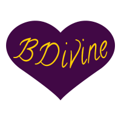

# Hi! 👋

<!--
**c0derbr1t/c0derbr1t** is a ✨ _special_ ✨ repository because its `README.md` (this file) appears on your GitHub profile.

Here are some ideas to get you started:

- 🔭 I’m currently working on ...
- 🌱 I’m currently learning ...
- 👯 I’m looking to collaborate on ...
- 🤔 I’m looking for help with ...
- 💬 Ask me about ...
- 📫 How to reach me: ...
- 😄 Pronouns: ...
- ⚡ Fun fact: ...
-->

## I'm Brittani Luce. 

### In the Coding world, I'd prefer to go by Britt.

-----
### About Me:

💜 &nbsp;&nbsp; Kindness, tolerance, and passion is everything.

🤯 &nbsp;&nbsp; I'm currently seeking endorsement with Lambda School after a rigorous year of intensive learning.

👩🏻‍💻 &nbsp;&nbsp; I'm actively looking for my first great Web Development position. I'd love to work in the Kansas City Metro area or remotely, but I'm open to relocation. The Pacific Northwest looks so lovely!

🌱 &nbsp;&nbsp;  I'm working on growing and expanding my skills and knowledge through small projects.

💬 &nbsp;&nbsp; Ask me about my three obnoxious but lovable cats!

-----
### Contact Me:

[LinkedIn](http://github.com)  
[Email](brittanidivine@gmail.com)  
[Twitter](https://twitter.com/home)  
[My Portfolio](https://brittaniluce.me/)  

-----  

  

BDivine: Coding with Kindness

<!--  -->

